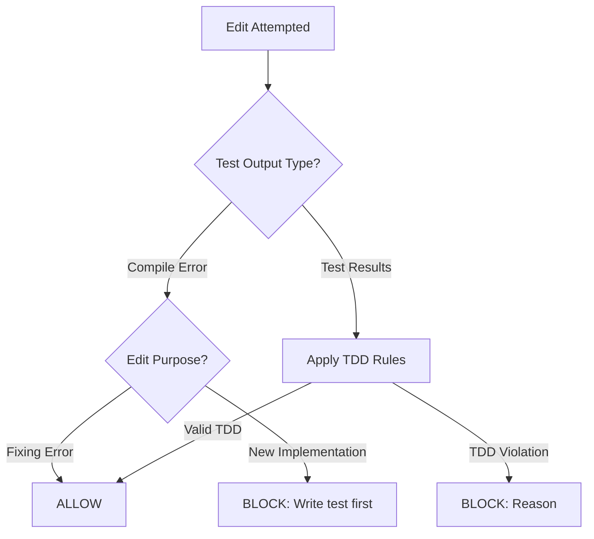

# ADR 0001: Compile Error Handling in TDD Verifier

## Status

Accepted

## Context

The TDD verifier enforces outside-in TDD by blocking edits when multiple tests fail:

```
unitFailingTests > 1 → BLOCK
```

This creates a deadlock for compiled languages:

1. User has 1 passing test (green)
2. User adds a new test with a compile error (typo, missing import)
3. Compiler fails for the entire file - reports errors for all tests
4. Verifier LLM interprets this as "2 failing tests" → BLOCK
5. User cannot edit to fix the compile error → **deadlock**

The root cause: compile errors and test failures are treated identically.

## Decision

Enhance the verifier LLM's system prompt to distinguish compile errors from test failures and apply appropriate rules:

```
Compile Error Handling:
- If test output shows compile/syntax errors (code doesn't run):
  - Fixing the compile error → ALLOW (restore runnable state)
  - Adding new implementation beyond the fix → BLOCK (write test first)
- Compile errors are NOT counted as failing tests
```

The LLM already has full context (edit content + test output) to make this judgment.

## Diagram



## Consequences

### Positive

- **No deadlock**: Users can always fix compile errors
- **Minimal change**: Only prompt modification, no new code paths
- **Language agnostic**: LLM recognizes compile errors in any language
- **Abuse prevention**: LLM detects if user sneaks implementation into "fix"

### Negative

- **LLM dependency**: Relies on LLM correctly distinguishing compile errors
- **Potential false positives**: LLM might misclassify edge cases

### Mitigations

- Add test cases for compile error scenarios
- Audit log captures all decisions for debugging
