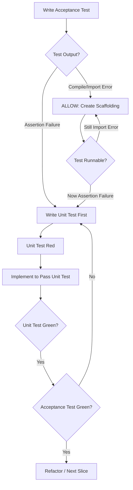

# 0002: Allow Scaffolding with Red Acceptance Test

## Status

Accepted

## Context

Outside-in TDD starts with a failing acceptance test as the "north star." Before drilling down to unit tests, developers often need to create minimal scaffolding—entry points, exports, type stubs—just to make the acceptance test _runnable_ (not pass).

The current rule `Implementation with 0 unit failing tests → BLOCK` is too strict. It blocks all implementation when only an acceptance test is red, forcing developers to write a unit test first. This circumvents the natural outside-in flow where the acceptance test guides initial exploration.

Example blocked workflow:

1. Write acceptance test for checkout feature
2. Run tests → fails with "Cannot find module './checkout'"
3. Try to create `checkout.ts` with empty export → **BLOCKED**
4. Driving LLM gets confused, writes unit test first (wrong)

## Decision

Add a new rule to the system prompt:

```
- Implementation with 1 red acceptance test and 0 red unit tests:
  - If acceptance test fails due to missing module/function → ALLOW scaffolding (make test runnable)
  - If acceptance test fails on assertion → BLOCK (write unit test first)
```

The LLM already analyzes test output for compile errors. It can distinguish:

- **Import/reference errors**: "Cannot find module", "is not defined", "has no exported member"
- **Assertion failures**: "Expected X but received Y", "toBe", "toEqual"

## Diagram



## Consequences

**Positive:**

- Natural outside-in TDD flow preserved
- Acceptance test truly guides the slice from the start
- Less confusion for driving LLM

**Negative:**

- Slightly more complex rule for LLM to apply
- Risk: LLM might allow too much "scaffolding" (mitigated by test output signal)

**Neutral:**

- No code changes to plugin—only system prompt update
