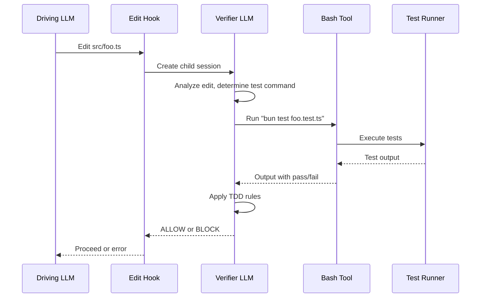

# ADR 0003: Verifier Runs Tests Directly

## Status

Accepted

## Context

The original design queried session history to find test output from the driving LLM's previous bash commands. This approach had several problems:

1. **Stale output**: The "last 5 bash outputs" heuristic might contain old test runs
2. **Irrelevant commands**: Session history includes non-test commands (git, npm install, etc.)
3. **Missing output**: Driving LLM might not have run tests recently
4. **Heuristic brittleness**: Hard to reliably identify which bash output contains test results

The verifier LLM already has full context about the edited file and understands the project structure. It can determine which tests to run.

## Decision

Replace session history query with verifier running tests directly in a child session with bash tool access.

The verifier:

1. Creates a child session with `tools: { bash: true }`
2. Analyzes the edited file to determine relevant tests
3. Runs tests using the appropriate command (npm test, bun test, etc.)
4. Uses fresh test output for ALLOW/BLOCK decision
5. Records test command and output in audit log

Timeout of 60 seconds with automatic BLOCK on timeout (fail-safe).

## Diagram

## Consequences

### Positive

- **Fresh output**: Always uses current test state, never stale
- **Targeted tests**: Verifier runs only relevant tests for the edited file
- **Self-contained**: No dependency on driving LLM's command history
- **Auditable**: Test command and output recorded for debugging

### Negative

- **Slower**: Adds test execution time to every edit verification
- **LLM cost**: Verifier must reason about which tests to run
- **Timeout risk**: Long-running tests may hit 60s timeout

### Mitigations

- Timeout defaults to BLOCK with actionable message ("try again")
- Verifier prompted to run targeted tests, not full suite
- Child session cleaned up even on timeout/error
