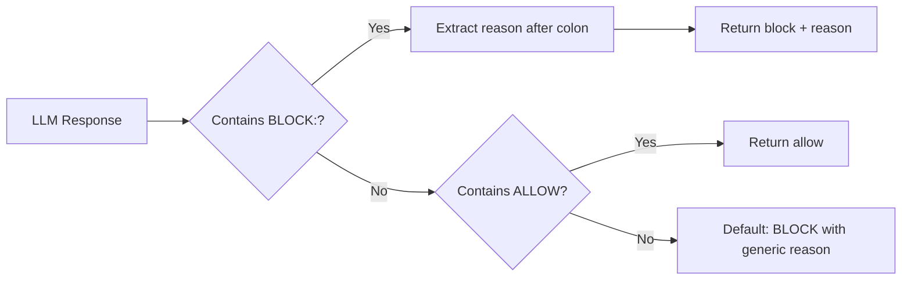

# ADR 0004: Plain Text Response Format

## Status

Accepted

## Context

The original verifier used structured JSON responses:

```json
{
  "editType": "impl",
  "testScope": "unit",
  "acceptanceFailingTests": 0,
  "unitFailingTests": 1,
  "decision": "allow",
  "reason": ""
}
```

This caused problems:

1. **LLM non-determinism**: Models often returned malformed JSON, extra fields, or wrapped in markdown
2. **Complex parsing**: Required JSON extraction from markdown code blocks, error handling for parse failures
3. **Conceptual mass**: Many fields that were only used for debugging, not decision-making
4. **Brittle**: Small formatting changes broke parsing

The actual decision is binary: allow or block with a reason.

## Decision

Simplify to plain text responses:

```
ALLOW
```

or

```
BLOCK: Write a failing test first
```

The verifier prompt uses chain-of-thought before the decision, but only the final line matters for parsing.

### Tolerant Parsing

LLMs often ignore formatting instructions. The parser:

1. Searches for `BLOCK:` anywhere in response (not just start)
2. Handles markdown bold: `**BLOCK: reason**`
3. Searches for `ALLOW` anywhere
4. Falls back to BLOCK with generic reason on parse failure

## Diagram



## Consequences

### Positive

- **Robust**: Plain text is harder to malform than JSON
- **Simple parsing**: Regex match instead of JSON parse + extraction
- **Tolerant**: Works even when LLM adds verbose reasoning
- **Reduced conceptual mass**: Removed 5 unused response fields

### Negative

- **Breaking change**: Old audit entries have different schema
- **Less structured**: Can't programmatically access test counts (but we never needed to)

### Mitigations

- Audit log still captures full response text for debugging
- Generic fallback reason is actionable ("Verification failed. Please retry this edit.")
